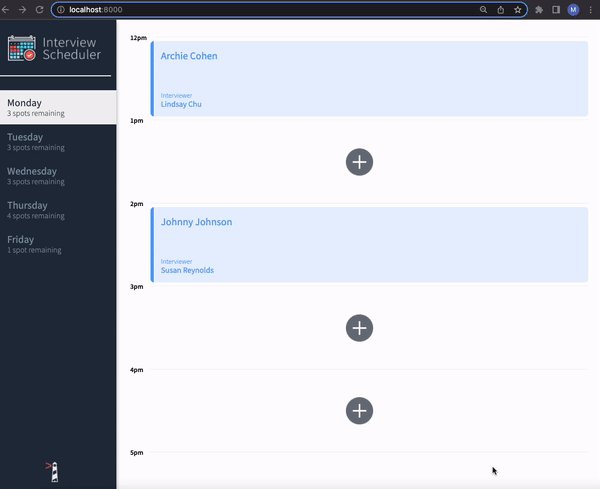
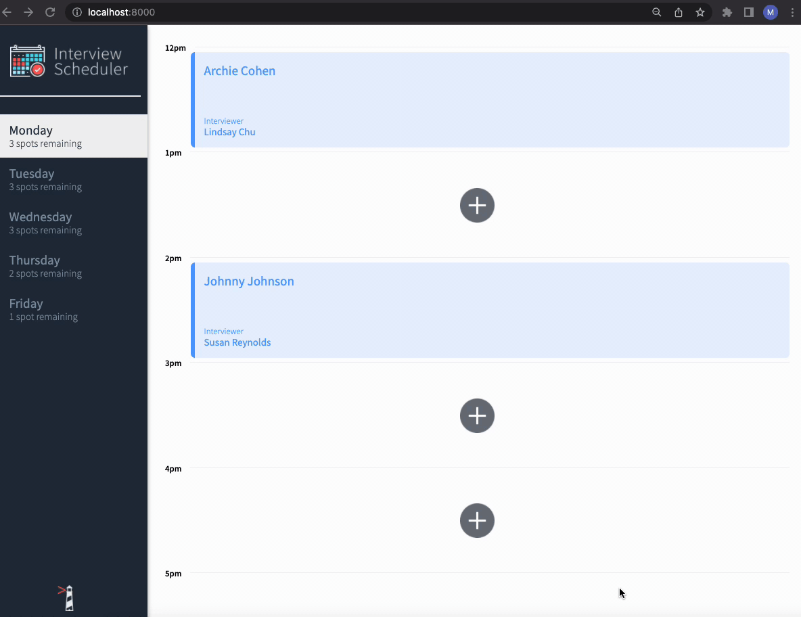
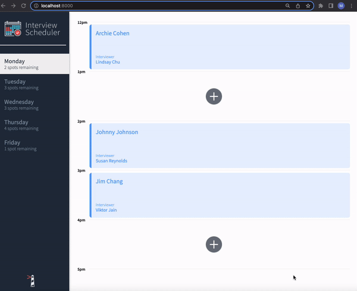
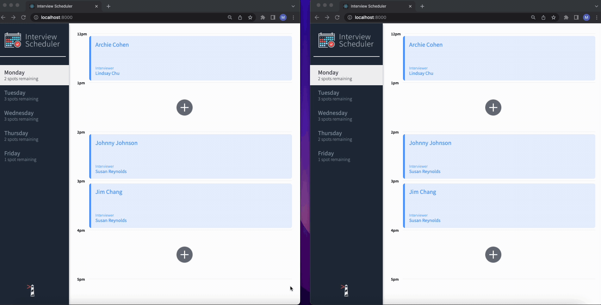

# Interview Scheduler

## Clone and run the scheduler api which which contains the database

Clone the repository: ` git clone https://github.com/merwynpgithub/scheduler-api`
<br />
Follow the readme directions of the repo, set up the database and run `npm start` in the scheduler api directory

## Setup for Scheduler APP

Install dependencies with `npm install`.

## Running Webpack Development Server

```sh
npm start
```

## Running Jest Test Framework

```sh
npm test
```

## Running Storybook Visual Testbed

```sh
npm run storybook
```
## Screenshots
### Scheduler Error

### Scheduler Add Appointment

### Scheduler Cancel Appointment

### Scheduler Update with WebSockets


## Dependencies used:
Express, React, Nodemon, Storybook, Cypress, React Testing Library
